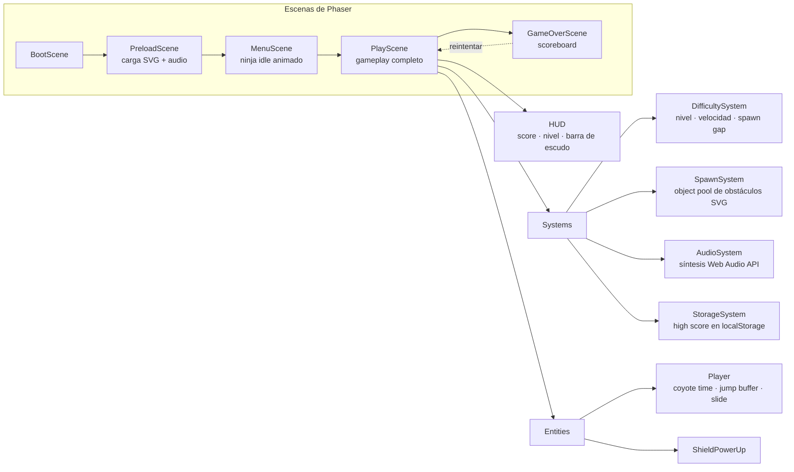
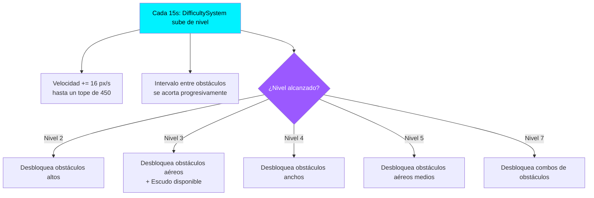

<div align="center">

# 🥷 Runner 2D DyM

**Endless runner 2D cyberpunk-ninja, construido con Phaser 3 + Vite — instalable como PWA y jugable 100% offline.**

[](https://runner.elmundodemanu.com/)
[](https://phaser.io)
[](https://vitejs.dev)
[]()
[]()

> *Un ninja cyberpunk que nunca se detiene. Tú decides si sobrevive.*

[🎮 Jugar](https://runner.elmundodemanu.com/) · [📦 Repositorio](https://github.com/Manu270422/runner-2d-dym) · [🏗️ Arquitectura](#️-arquitectura) · [🚀 Desarrollo local](#-instalación-y-desarrollo-local)

</div>

---

## 📖 Sobre el proyecto

**Runner 2D DyM** es un *endless runner* de scroll lateral: el ninja avanza solo, y el jugador decide cuándo saltar y cuándo deslizarse para esquivar una ciudad cyberpunk llena de obstáculos ninja. La dificultad escala sola con el tiempo — más velocidad, más tipos de obstáculo, menos margen de error — hasta que un choque termina la carrera.

Igual que el resto de mis proyectos, no es solo "que funcione": está construido con las mismas prácticas que se esperan de un juego web serio — **cero assets pesados o binarios innecesarios** (los obstáculos son SVG vectoriales, el ninja se dibuja por código, el sonido se sintetiza), **object pooling real** para no generar presión sobre el garbage collector, y una **PWA instalable que funciona sin conexión** gracias a un Service Worker propio.

---

## ✨ Características

- 🏃 **Movimiento con feel de plataformero pulido**: *Coyote Time* (margen de gracia para saltar tras caer de un borde) y *Jump Buffering* (recuerda el salto si se presionó un instante antes de tocar tierra).
- 🩹 **Slide dinámico**: reduce la hitbox del ninja en tiempo real para esquivar obstáculos aéreos, con un pequeño boost de velocidad durante la maniobra.
- 🛡️ **Escudo temporal**: aparece a partir del nivel 3 y absorbe un golpe completo.
- 📈 **Dificultad progresiva y predecible**: cada 15 segundos sube de nivel — más velocidad, más tipos de obstáculo desbloqueados — nunca aleatoria injusta.
- 🎨 **9 obstáculos temáticos en SVG vectorial** (katana, torii, bambú, hoguera, entre otros), nítidos en cualquier resolución y de apenas 1–3 KB cada uno.
- 🔊 **Audio sintetizado + efectos `.wav` livianos**: sistema de sonido propio sobre Web Audio API.
- 📱 **PWA real**: instalable en Android, iOS y escritorio, con Service Worker (`Cache First` para assets, `Network First` para HTML) que permite jugar sin conexión.
- ⚡ **Object pooling de obstáculos**: se reciclan en vez de crearse/destruirse en cada spawn — cero asignaciones de memoria nuevas durante el juego.
- 🖥️ **Responsive real**: `Scale.FIT` de Phaser adapta el canvas a cualquier pantalla sin escribir código de responsive a mano.

---

## 🎮 Controles

| Acción | Teclado | Táctil |
|---|---|---|
| Saltar | `Espacio` · `W` · `↑` | Toque en la mitad superior de la pantalla |
| Deslizarse (slide) | `S` · `↓` | Toque en la mitad inferior de la pantalla |
| Pausar | `ESC` | Botón de pausa en pantalla |

---

## 🗡️ Obstáculos

Cada obstáculo tiene su propia hitbox ajustada (más pequeña que el sprite visual, para que las colisiones se sientan justas) y un nivel mínimo de aparición.

**Se evaden saltando:**

| Obstáculo | Descripción |
|---|---|
| Katana | Espadas clavadas en el suelo, verticales o inclinadas |
| Roca | Peñascos con musgo y grietas |
| Tronco | Árbol caído |
| Caja / Cajas apiladas | Suministros de madera con kanji decorativo |
| Hoguera ninja | Fogata enemiga con llamas y humo |
| Muro Shoji | Panel de papel japonés con marco de madera |

**Se evaden deslizándose (slide):**

| Obstáculo | Descripción |
|---|---|
| Torii roto | Arco japonés caído — pasa por debajo |
| Bambú | Ramas dobladas a media altura |
| Cuerda con cascabeles | Trampa de alarma ninja colgante |

---

## 🏗️ Arquitectura



### Cómo escala la dificultad

`DifficultySystem` sube de nivel cada 15 segundos y, en cascada, todo lo demás reacciona: la velocidad global sube, el tiempo entre obstáculos baja, y se desbloquean tipos de obstáculo nuevos — nunca aparecen todos desde el inicio.



---

## 🛠️ Stack tecnológico

| Herramienta | Versión | Uso |
|---|---|---|
| [Phaser](https://phaser.io) | 3.88 | Motor de juego 2D — física Arcade, escenas, Scale Manager |
| [Vite](https://vitejs.dev) | 5.x | Bundler y servidor de desarrollo con hot-reload |
| Web Audio API | Nativa | Sintetizador de efectos de sonido |
| Service Worker | Nativo | PWA — juego 100% jugable offline |
| SVG | Estándar W3C | Todos los obstáculos, vectoriales y livianos |

---

## 📂 Estructura del proyecto

```
runner-2d-dym/
├── public/
│   ├── CNAME                      # dominio propio: runner.elmundodemanu.com
│   └── assets/
│       ├── audio/                  # jump.wav, hit.wav
│       ├── images/                 # logo (ícono PWA)
│       └── svg/                    # 9 obstáculos vectoriales
│
├── src/
│   ├── main.js                     # Entry point + configuración de Phaser
│   ├── config/
│   │   └── GameConfig.js           # Todas las constantes de balance (GAMEPLAY.*)
│   ├── scenes/
│   │   ├── BootScene.js            # Oculta el splash y arranca PreloadScene
│   │   ├── PreloadScene.js         # Carga assets con barra de progreso
│   │   ├── MenuScene.js            # Menú principal
│   │   ├── PlayScene.js            # Gameplay completo
│   │   └── GameOverScene.js        # Pantalla de fin + puntaje
│   ├── entities/
│   │   ├── Player.js                # Ninja — animación procedural, coyote time, slide
│   │   └── ShieldPowerUp.js         # Power-up coleccionable
│   ├── systems/
│   │   ├── AudioSystem.js           # Sintetizador de sonido
│   │   ├── DifficultySystem.js      # Velocidad y desbloqueo de obstáculos por nivel
│   │   ├── SpawnSystem.js           # Object pooling de obstáculos SVG
│   │   └── StorageSystem.js         # Persistencia de high score en localStorage
│   └── ui/
│       └── HUD.js                   # Score, nivel, barra de escudo
│
├── index.html
├── manifest.json                   # PWA manifest
├── sw.js                            # Service Worker (offline)
├── vite.config.js
└── package.json
```

### Decisiones de arquitectura

| Decisión | Por qué |
|---|---|
| **Phaser 3 + Arcade Physics** | Motor maduro, ligero, perfecto para un runner 2D — no hace falta más. |
| **SVG para obstáculos** | Escalables sin pixelación y de apenas 1–3 KB cada uno. |
| **Sintetizador Web Audio + `.wav` livianos** | Audio funcional sin depender de archivos pesados. |
| **Object pooling en `SpawnSystem`** | Los obstáculos se reciclan en vez de crearse/destruirse en cada spawn → cero presión sobre el garbage collector. |
| **Ninja dibujado por código en `Player.js`** | No requiere spritesheet externo; fácil de reemplazar por uno real si se desea (documentado más abajo). |
| **Scale Manager `FIT`** | Phaser gestiona el responsive automáticamente en cualquier dispositivo, sin CSS manual. |
| **Gravedad gestionada en `Player`, no en la config global de Arcade** | Da control fino sobre coyote time y jump buffering, imposible de lograr solo con la gravedad estándar del motor. |

---

## 🚀 Instalación y desarrollo local

**Requisitos:** Node.js ≥ 18, npm ≥ 9.

```bash
# Clonar el repositorio
git clone https://github.com/Manu270422/runner-2d-dym.git
cd runner-2d-dym

# Instalar dependencias
npm install

# Servidor de desarrollo con hot-reload
npm run dev
# → http://localhost:3000

# Build de producción
npm run build
# → carpeta /dist lista para deploy

# Previsualizar el build
npm run preview
```

---

## 📱 PWA — instalable como app

Runner 2D DyM es una **Progressive Web App** real, no solo una etiqueta:

- **Android** → Chrome → Menú → *"Añadir a pantalla de inicio"*
- **iOS** → Safari → Compartir → *"Añadir a pantalla de inicio"*
- **PC** → Chrome/Edge → ícono de instalación en la barra de direcciones

El Service Worker (`sw.js`) precachea el shell de la app (`index.html`, `offline.html`, `manifest.json`) con estrategia *Cache First* para assets y *Network First* para HTML, así que **el juego funciona completamente sin conexión** una vez instalado.

---

## 🎨 Personalización

### Ajustar dificultad

Editar `src/config/GameConfig.js`:

```js
BASE_SPEED:      220,   // Velocidad inicial (px/seg)
MAX_SPEED:       450,   // Velocidad máxima
LEVEL_DURATION:   15,   // Segundos entre cada nivel
SPAWN_MIN_GAP:   0.75,  // Mínimo tiempo entre obstáculos
```

### Agregar un obstáculo nuevo

1. Crear el SVG en `public/assets/svg/mi_obstaculo.svg`.
2. Registrarlo en `GameConfig.js`, dentro de `ASSETS.svg`.
3. Se carga automáticamente en `PreloadScene.js` al estar en `ASSETS.svg`.
4. Definirlo en `SpawnSystem.js`:

```js
const OBSTACLE_DEFS = {
  // ...existentes...
  mi_obstaculo: {
    key: 'mi_obstaculo',
    evasion: 'jump',        // 'jump' o 'slide'
    w: 60, h: 80,            // dimensiones en pantalla
    hitBox: { ox: 8, oy: 8, w: 44, h: 64 }, // hitbox justa (menor que el visual)
    minLevel: 2               // nivel mínimo para que aparezca
  }
};
```

5. `DifficultySystem` lo mostrará automáticamente al llegar al nivel indicado.

### Reemplazar el ninja por sprites reales

`Player.js` dibuja al ninja por código en su método `_draw()`. Para usar un spritesheet en su lugar:

```js
// En PreloadScene:
this.load.spritesheet('ninja', 'assets/sprites/ninja.png', {
  frameWidth: 48, frameHeight: 64
});

// En Player.js, reemplazar el Graphics por:
this._sprite = scene.add.sprite(0, -22, 'ninja');
this.add(this._sprite);

scene.anims.create({
  key: 'run',
  frames: scene.anims.generateFrameNumbers('ninja', { start: 0, end: 7 }),
  frameRate: 14, repeat: -1
});
```

---

## ⚡ Rendimiento

| Métrica | Valor |
|---|---|
| Bundle JS del juego | ~30 KB (gzip) |
| Phaser (chunk separado) | ~340 KB (gzip) |
| SVG de obstáculos | 1–3 KB c/u |
| FPS objetivo | 60 FPS constantes |
| Estrategia de memoria | Object pooling — sin nuevas asignaciones en runtime |

---

## 👤 Autor

**Carlos Manuel Turizo Hernández** ([@Manu270422](https://github.com/Manu270422)) — DyM
Estudiante de Ingeniería Informática (UNIPAZ) y Análisis y Desarrollo de Software (SENA), Colombia · [El Mundo de Manu](https://elmundodemanu.com)

---

<div align="center">

**[🎮 Probar Runner 2D DyM ahora →](https://runner.elmundodemanu.com/)**

Hecho con 🥷 y mucho café en Colombia 🇨🇴

</div>